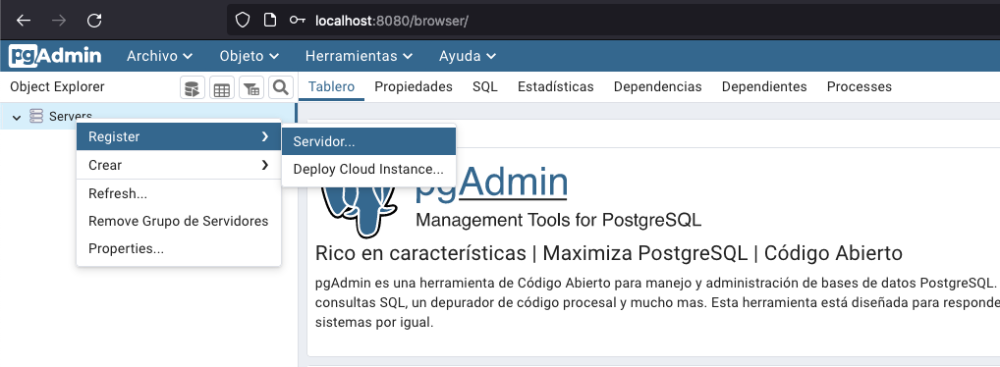
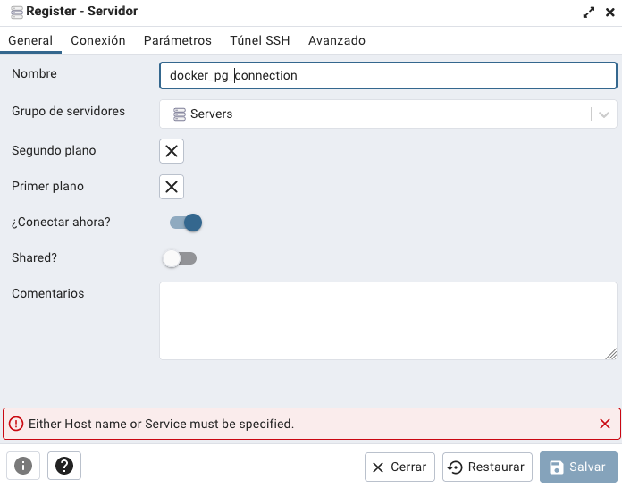
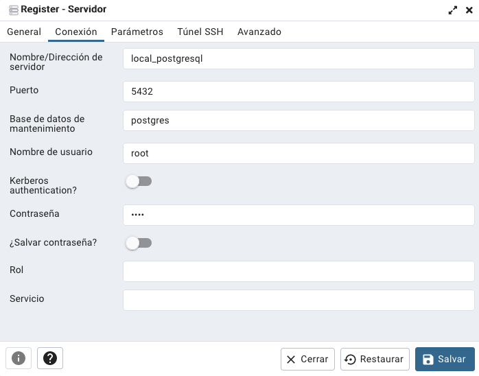

[](https://hub.docker.com/_/postgres)
[](https://hub.docker.com/r/dpage/pgadmin4/)

[](LICENSE)


# PostgreSQLPgAdmin
Este repositorio permite correr un ambiente local de [Postgres](https://hub.docker.com/_/postgres) con [PgAdmin](https://hub.docker.com/r/dpage/pgadmin4/)


# Inicio

1. Una vez se clone el proyecto

    ```bash
    git clone https://github.com/HubertRonald/PostgreSQLPgAdmin.git
    ``` 

2. Luego habilita los siguientes scripts de bash para que puedan ser ejecutados:

    ```bash
    chmod +x start.sh stop.sh
    ```

3. Asegurase de tener **[Docker Desktop](https://www.docker.com/products/docker-desktop/)** encendido

4. Se puede iniciar rápidamente desde la terminal con:

    ```bash
    ./start.sh
    ```

5. Una vez levantado el contenedor ingresa a **[localhost:8080](http://localhost:8080/)** loguearte con:

    |Concepto|Parámetro|
    |---|---|
    |correo/usuario| [me@admin.com](.env#L14)|
    |clave| [admin](.env#L15)|

    > **Nota:** Tener presente que el port de entrada al pgadmin es `80` en el contenedor por defecto.

6. Registrar un servidor (ver el servicio: [db del docker-compose.yml](docker-compose.yml#L5))
    


7. En la pestaña `General` asignar el nombre que prefieras
    


8. En la pestaña `Conexión` los valores son los correspondientes a:
    |Concepto|Parámetro|Nota|
    |---|---|---|
    |Nombre/Dirección de servidor|[local_postgresql](.env#L4)||
    |Puerto|[5432](docker-compose.yml#L21) |En local se define así en postgres por defecto. El puerto de entrada hacia el contenedor puede ser el que prefieras (5050)|
    |Nombre de usuario| [root](.env#L6)||
    |clave| [root](.env#L7)||

    


9. Para finalizar el proceso (saliendo previamente del pgadmin), en la terminal correr:

    ```bash
    ./stop.sh
    ```

> **Nota:** Tener encuenta que el archivo `.env` se sube a este repo a modo de ejemplo, removerlo (o comentarlo) en el .gitignore cuando clones el proyecto para que puedas personalizar tus claves y demás

# Enlaces
Muestra de bases de datos en Postgres
- [Sample Database](https://wiki.postgresql.org/wiki/Sample_Databases)

# .gitignore

Fue generado en [gitignore.io](https://www.toptal.com/developers/gitignore/) con los filtros `macos`, `windows` y consumido mediante su API como archivo crudo desde la terminal:

```bash
curl -L https://www.toptal.com/developers/gitignore/api/macos,windows > .gitignore
```

> **Nota:** Tener encuenta que el archivo `.env` se sube a este repo a modo de ejemplo, removerlo (o comentarlo) en el .gitignore cuando clones el proyecto para que puedas personalizar tus claves y demás

# Autores
---
* **Hubert Ronald** - *Trabajo Inicial* - [HubertRonald / PostgreSQLPgAdmin](https://github.com/HubertRonald/PostgreSQLPgAdmin)

Ve también la lista de [contribuyentes](https://github.com/HubertRonald/PostgreSQLPgAdmin/contributors) que participaron en este proyecto.


# Licencia
---
Este proyecto está bajo licencia MIT - ver la [LICENCIA](LICENSE) archivo (en inglés) con más detalles